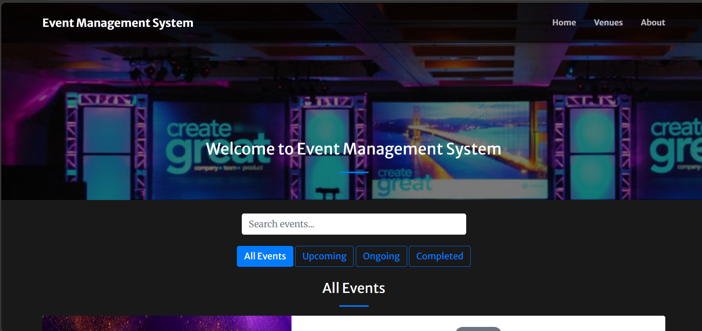
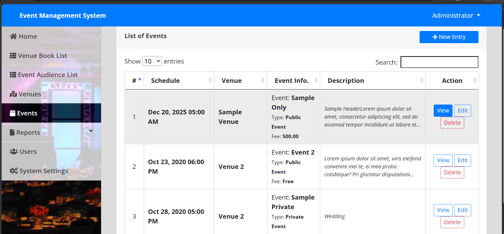
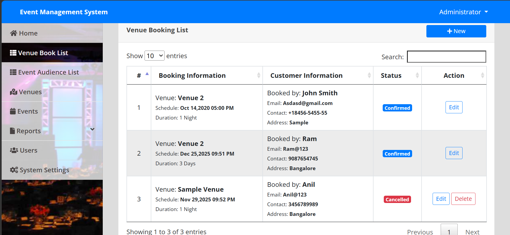
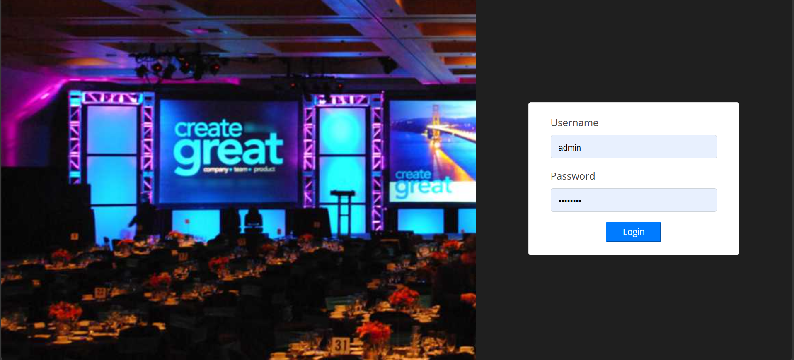

# 🎉 Event Management System

A web-based Event Management System developed using PHP and MySQL.
It allows users to view events and venues, and admins can manage data through a dashboard.

---

## 🚀 Features

- View Events
- View Venues
- Admin Dashboard

---

## 🖼️ Screenshots

### 🏠 Home Page

### 📅 Events Page

### 🏢 Venue Page

### ⚙️ Admin Dashboard

---

## 🛠️ Technologies Used

- PHP
- MySQL
- HTML, CSS, JavaScript
- Bootstrap

---

## ⚙️ How to Run

1. Move project to htdocs
2. Start Apache and MySQL in XAMPP
3. Import database into phpMyAdmin
4. Open in browser:
   http://localhost/Event_Management_System-master/home.php
